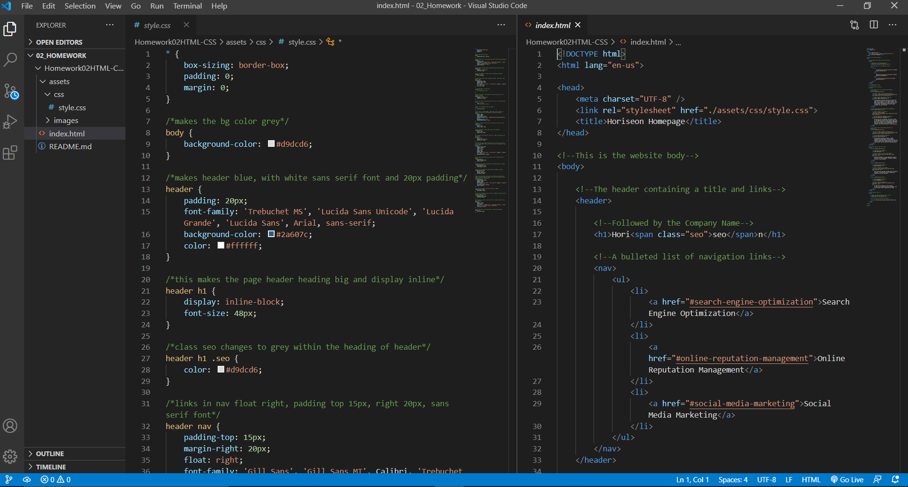

# Homework02HTML-CSS
## Description
This repository is where i've uploaded my first homework assignment. The source code was originally pulled from Github, where several key changes were made. The first was to remove all general 'div'elements, and replace with semantic HTML elements, without changing the general layout, or appearance of the webpage. Once completed, the linked CSS file was edited, so that all selectors matched the elements located in the index.html directory. This included following the **Scout Rule**. I consolidated CSS selectors that had identical properties, making the document easier to read. The last thing you will notice are comments outlining what each HTML element does in the pages layout, and each CSS selectors purpose. 
## Table of Contents
I added a table of contents just to see if I could figure out how to do it. The links below take you through this README.
* [Installation] (## Installation)
## Installation
## Usage
I used the text editor Visual Studio Code to edit the HTML and CSS files. Then, I added the edited files to my local repository, committing the changes with unique specific comments, pulled all remote repository files and pushed the remaining changes to this remote repository. This image shows the completed, edited documents.
image

## Credits
## License
## Badges
## Features
## Contributing
## Tests
